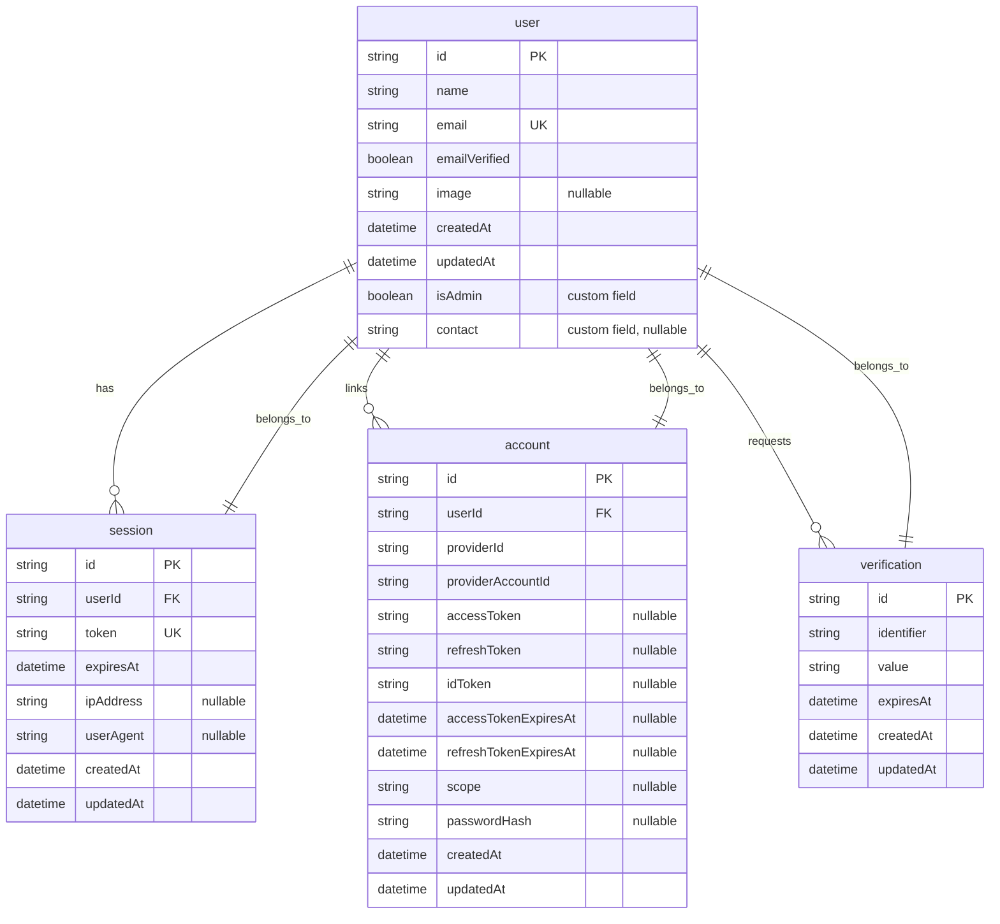
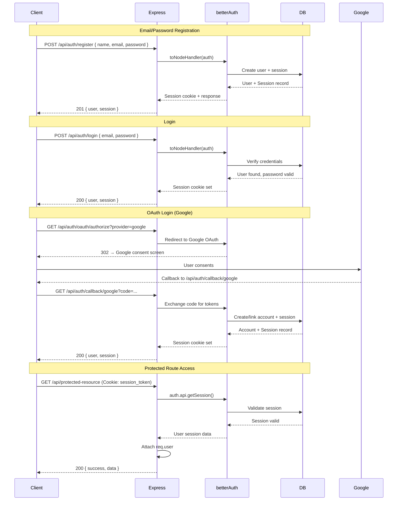
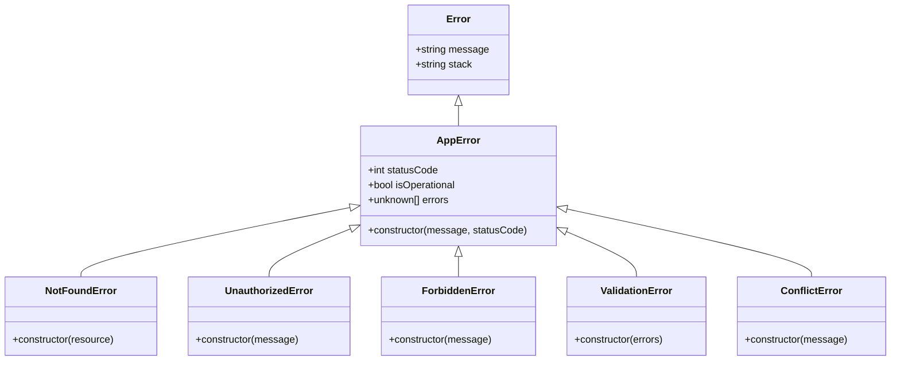
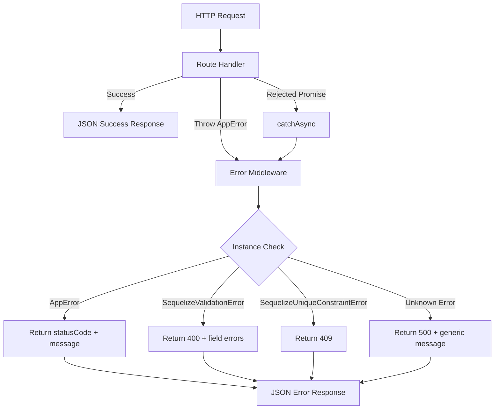

# Backend Project Proposal — aone-backend

## 1. Project Overview

A Node.js + Express REST API backend with **session-based authentication** powered by `better-auth`. The project uses Sequelize ORM with PostgreSQL for data persistence and is transitioning from a legacy JWT-based auth system to a modern session-based architecture with OAuth social login support.

---

## 2. Problem Statement

Modern web applications require secure, flexible authentication mechanisms that support both traditional email/password login and social identity providers. The existing codebase was originally built with JWT-based authentication (`jsonwebtoken` + `bcryptjs`) and needs to evolve to support multiple OAuth providers (Google, GitHub, Discord, Apple, Microsoft) while maintaining session security and a consistent API response contract.

The project is currently in a partial migration state, requiring stabilization of the better-auth integration and re-establishment of database connectivity patterns for future custom business models.

---

## 3. Objectives

- Implement a unified authentication system supporting email/password and five OAuth providers
- Provide a session-based auth middleware for protecting custom API routes
- Maintain a consistent JSON response envelope (`{ success, message, data }`)
- Provide reusable error handling with custom typed error classes
- Set up a scalable folder structure for adding domain models, controllers, and routes
- Establish PostgreSQL database connectivity via Sequelize for future custom models

---

## 4. Scope

**In scope:**
- User registration and login via email/password (`POST /api/auth/register`, `POST /api/auth/login`)
- Session management (`GET /api/auth/session`, `POST /api/auth/logout`)
- Password reset flow (`POST /api/auth/forget-password`, `POST /api/auth/reset-password`)
- OAuth social login via Google, GitHub, Discord, Apple, and Microsoft
- Account linking across multiple identity providers
- Session middleware for route protection (`requireSession`)
- Centralized error handling with AppError class hierarchy
- Sequelize ORM configuration for PostgreSQL
- Global security middleware (Helmet, CORS)

**Not implemented (codebase does not contain):**
- Custom domain models (Product, Order, etc.) — No models beyond auth exist
- Custom CRUD controllers — Only auth controllers exist (and only in legacy `dist/`)
- Input validation middleware (`express-validator`) — No validator files exist in source
- Role-based access control beyond `isAdmin` boolean field — No `authorize()` middleware in source
- Database migrations — Sequelize is configured but no migrations exist
- Testing framework — No test files or configuration found
- Rate limiting — No rate limiter middleware configured
- API documentation (Swagger/OpenAPI) — Not implemented
- File upload handling — Not implemented
- WebSocket support — Not implemented
- Caching layer — Not implemented
- Audit logging — Not implemented

---

## 5. Backend Technology Stack

| Technology | Version | Purpose |
|---|---|---|
| **Node.js** | >=18 | Runtime environment |
| **Express** | ^5.2.1 | HTTP framework |
| **TypeScript** | ^5.7.3 | Typed superset of JavaScript |
| **better-auth** | ^1.6.23 | Session-based authentication with OAuth |
| **Sequelize** | ^6.37.8 | ORM for PostgreSQL |
| **PostgreSQL** | (pg ^8.22.0) | Relational database |
| **pg-hstore** | ^2.3.4 | PostgreSQL hstore support for Sequelize |
| **dotenv** | ^17.4.2 | Environment variable loading |
| **cors** | ^2.8.6 | Cross-Origin Resource Sharing |
| **helmet** | ^8.2.0 | Security HTTP headers |
| **morgan** | ^1.11.0 | HTTP request logging |
| **tsx** | ^4.22.4 | TypeScript execution for development |
| **tsc** | (TypeScript) | TypeScript compilation for production |

---

## 6. Project Architecture

### 6.1 High-Level Architecture

```
┌─────────────┐     HTTP/HTTPS     ┌─────────────────────────────────────┐
│   Client    │ ──────────────────▶ │         Express Application         │
│ (React App) │ ◀────────────────── │                                     │
└─────────────┘     JSON Resp.     │  ┌───────────┐  ┌────────────────┐  │
                                    │  │   Auth    │  │  Custom Routes │  │
                                    │  │  Handler  │  │  (future)      │  │
                                    │  │better-auth│  │  /api/*        │  │
                                    │  └─────┬─────┘  └───────┬────────┘  │
                                    │        │                  │           │
                                    │  ┌─────▼──────────────────▼────────┐ │
                                    │  │      Error Handler Middleware    │ │
                                    │  └──────────────┬──────────────────┘ │
                                    └─────────────────┼────────────────────┘
                                                       │
                                    ┌──────────────────▼──────────────────┐
                                    │         PostgreSQL Database          │
                                    │  (better-auth schema + future       │
                                    │   Sequelize models)                 │
                                    └─────────────────────────────────────┘
```

### 6.2 Request Flow

```
HTTP Request
     │
     ▼
┌──────────────────────────┐
│   Global Middleware       │  Helmet → CORS → Morgan
└──────────┬───────────────┘
           │
           ▼
┌──────────────────────────┐
│   better-auth Handler     │  Auto-handles /api/auth/{*path}
│   (toNodeHandler)         │  Register, Login, Logout, Session, OAuth
└──────────┬───────────────┘
           │
           ▼
┌──────────────────────────┐
│   JSON Body Parser        │  express.json() + urlencoded
└──────────┬───────────────┘
           │
           ▼
┌──────────────────────────┐
│   Custom Routes (/api)    │  Protected by requireSession middleware
└──────────┬───────────────┘
           │
     ┌─────┴─────┐
     ▼           ▼
  Success      Error
     │           │
     ▼           ▼
  JSON Resp.  error.middleware.ts
                  │
                  ▼
             JSON Error Resp.
```

---

## 7. Folder Structure

```
backend/
├── auth/
│   └── auth.ts                 # better-auth configuration (providers, DB pool, user fields)
├── config/
│   ├── env.config.ts           # .env loader (port, DB, better-auth config)
│   └── db.config.ts            # Sequelize + PostgreSQL connection
├── docs/
│   └── PROJECT_OVERVIEW.md     # Developer documentation
├── middlewares/
│   ├── session.middleware.ts   # better-auth session validation (requireSession)
│   └── error.middleware.ts     # Global error formatter (AppError + Sequelize errors)
├── models/
│   └── index.ts                # Sequelize initialization and exports
├── routes/
│   └── index.ts                # Route aggregator (empty, awaiting custom routes)
├── utils/
│   ├── AppError.ts             # Custom error class hierarchy
│   └── catchAsync.ts           # Async handler wrapper
├── .env                        # Environment variables
├── AGENTS.md                   # AI assistant onboarding
├── index.ts                    # Express app entry point
├── package.json
└── tsconfig.json
```

### Directory Purpose

| Directory | Purpose |
|---|---|
| `auth/` | better-auth plugin configuration — OAuth providers, database pool, custom user fields |
| `config/` | Environment variable loading and database connection setup |
| `middlewares/` | Express middleware — session validation and error handling |
| `models/` | Sequelize model definitions and database initialization |
| `routes/` | Custom API route definitions (currently empty; auth handled by better-auth) |
| `utils/` | Shared utilities — custom error classes and async wrapper |
| `docs/` | Developer documentation |

---

## 8. Database Design and Relationships

### 8.1 Database Tables (Managed by better-auth)

better-auth automatically manages its own schema in PostgreSQL. The following tables are created and maintained by the library:

| Table | Purpose |
|---|---|
| `user` | Core user accounts — stores id, name, email, emailVerified, image, createdAt, updatedAt, plus custom fields (isAdmin, contact) |
| `session` | Active sessions — stores session tokens, expiry, and user association |
| `account` | OAuth provider accounts — stores provider-specific credentials per user |
| `verification` | Email verification and password reset tokens |

### 8.2 Entity Relationship Diagram



### 8.3 Sequelize Custom Models

The Sequelize instance is configured and ready for custom domain models (e.g., Product, Order). Currently, no custom models are defined. The `models/index.ts` exports the Sequelize instance, and the startup process performs `db.sequelize.authenticate()` to verify database connectivity.

---

## 9. Main Modules

### 9.1 Authentication Module (`auth/auth.ts`)

- Configures better-auth with a PostgreSQL connection pool
- Enables email/password authentication
- Configures five OAuth providers: Google, GitHub, Discord, Apple, Microsoft
- Defines custom user fields: `isAdmin` (boolean, non-input) and `contact` (string, optional)
- Enables account linking across trusted providers

### 9.2 Session Middleware (`middlewares/session.middleware.ts`)

- `requireSession` — Validates the session from request headers/cookies via `auth.api.getSession()`
- Throws `UnauthorizedError` (401) if no valid session exists
- Attaches `req.user` with full user object including custom fields

### 9.3 Error Handling Module (`utils/AppError.ts` + `middlewares/error.middleware.ts`)

**Error class hierarchy:**
```
Error
 └── AppError (base, operational flag)
      ├── NotFoundError       (404)
      ├── UnauthorizedError   (401)
      ├── ForbiddenError      (403)
      ├── ValidationError     (400)
      └── ConflictError       (409)
```

- Error middleware catches all errors, logs them, and returns consistent JSON
- Handles `AppError` instances with their specific status codes and messages
- Handles `SequelizeValidationError` → 400 with field errors
- Handles `SequelizeUniqueConstraintError` → 409
- Falls back to 500 for unknown errors

### 9.4 Database Module (`config/db.config.ts` + `models/index.ts`)

- Creates a Sequelize instance connected to PostgreSQL
- Connection pool: max 5, min 0, acquire 30s, idle 10s
- Logging disabled for production cleanliness
- `models/index.ts` exports the sequelize instance for model registration and application use

### 9.5 Async Handler Utility (`utils/catchAsync.ts`)

- Wraps async route handlers to automatically forward rejected promises to the error middleware
- Eliminates the need for try/catch blocks in controllers

---

## 10. API Overview

### 10.1 better-auth Auto-Generated Endpoints

| Method | Endpoint | Description | Auth |
|---|---|---|---|
| `POST` | `/api/auth/register` | Email/password user registration | None |
| `POST` | `/api/auth/login` | Email/password login | None |
| `POST` | `/api/auth/logout` | End current session | Session |
| `POST` | `/api/auth/forget-password` | Request password reset email | None |
| `POST` | `/api/auth/reset-password` | Reset password with token | None |
| `GET` | `/api/auth/session` | Get current session and user | Session |
| `GET` | `/api/auth/me` | Get current authenticated user | Session |
| `GET` | `/api/auth/callback/:provider` | OAuth callback handler | None |
| `POST` | `/api/auth/oauth/authorize` | Initiate OAuth flow | None |

### 10.2 Application Endpoints

| Method | Endpoint | Description | Auth |
|---|---|---|---|
| `GET` | `/` | Health check — server status | None |

### 10.3 Custom Routes (No custom routes currently implemented)

The `routes/index.ts` file is an empty router awaiting future custom route groups.

---

## 11. Authentication and Authorization Flow



### Authorization

- **Role-based access control (RBAC) is not implemented** beyond the `isAdmin` boolean field on the user model.
- The `requireSession` middleware simply checks for a valid authenticated session.
- There is no `authorize()` middleware or role/permission enumeration in the source code.
- Custom routes requiring admin access would need to check `req.user.isAdmin` manually.

---

## 12. Business Logic

The current codebase does not implement custom business logic. All business functionality is limited to authentication flows handled by better-auth:

- **User Registration**: Creates a user account with email/password, auto-creates session
- **User Login**: Validates credentials, creates session, returns session cookie
- **Session Management**: Maintains HTTP-only session cookies with configurable expiry
- **OAuth Account Linking**: Associates multiple OAuth provider accounts with a single user profile
- **Password Reset**: Token-based password reset flow via email
- **Session Validation**: Middleware validates session on every protected request

---

## 13. Functional Requirements

| ID | Requirement | Status |
|---|---|---|
| FR-01 | User can register with name, email, and password | Implemented (better-auth) |
| FR-02 | User can log in with email and password | Implemented (better-auth) |
| FR-03 | User can log out (end session) | Implemented (better-auth) |
| FR-04 | User can request a password reset email | Implemented (better-auth) |
| FR-05 | User can reset password using a reset token | Implemented (better-auth) |
| FR-06 | User can sign in via Google OAuth | Implemented (better-auth) |
| FR-07 | User can sign in via GitHub OAuth | Implemented (better-auth) |
| FR-08 | User can sign in via Discord OAuth | Implemented (better-auth) |
| FR-09 | User can sign in via Apple OAuth | Implemented (better-auth) |
| FR-10 | User can sign in via Microsoft OAuth | Implemented (better-auth) |
| FR-11 | User can retrieve current session info | Implemented (better-auth) |
| FR-12 | User accounts can be linked across multiple providers | Implemented (better-auth) |
| FR-13 | Protected routes reject unauthenticated requests with 401 | Implemented (requireSession) |
| FR-14 | Server health check endpoint returns 200 | Implemented (`GET /`) |
| FR-15 | Custom domain CRUD operations | Not implemented |
| FR-16 | Input validation for custom routes | Not implemented |
| FR-17 | Role-based access control for admins | Not implemented |

---

## 14. Non-Functional Requirements

| ID | Requirement | Current State |
|---|---|---|
| NFR-01 | **Security**: HTTP security headers (Helmet) | Implemented |
| NFR-02 | **Security**: CORS whitelisting | Implemented (default: `http://localhost:3000`) |
| NFR-03 | **Security**: Session-based auth (no JWT exposure) | Implemented (better-auth sessions) |
| NFR-04 | **Reliability**: Global error handling with consistent JSON | Implemented |
| NFR-05 | **Reliability**: Graceful handling of database errors | Implemented (Sequelize error handling) |
| NFR-06 | **Maintainability**: TypeScript type safety | Implemented |
| NFR-07 | **Maintainability**: ESM module system | Implemented (`"type": "module"`) |
| NFR-08 | **Performance**: Database connection pooling | Implemented (max 5 connections) |
| NFR-09 | **Logging**: HTTP request logging via Morgan | Implemented (`dev` format) |
| NFR-10 | **Scalability**: Database sync/migrations | Not implemented — no migration system |
| NFR-11 | **Testing**: Automated test suite | Not implemented |
| NFR-12 | **Monitoring**: Application performance monitoring | Not implemented |
| NFR-13 | **Rate Limiting**: API rate limiting | Not implemented |

---

## 15. Security Measures

| Measure | Implementation |
|---|---|
| HTTP Security Headers | `helmet()` middleware sets Content-Security-Policy, X-Frame-Options, X-Content-Type-Options, etc. |
| CORS | Configured with explicit origin and `credentials: true` for cookie-based auth |
| Session-Based Auth | No JWT tokens exposed to client — sessions managed via HTTP-only cookies |
| Password Hashing | Handled by better-auth internally (bcrypt/argon2) |
| OAuth | Token exchange handled by better-auth — no manual OAuth flow implementation |
| Account Linking | Trusted providers must be explicitly whitelisted |
| Environment Variables | Secrets stored in `.env` (gitignored) |
| No Secrets in Code | All secrets (DB password, auth secret, OAuth client secrets) loaded from environment |
| Operational Error Separation | Custom `AppError.isOperational` flag distinguishes expected failures from bugs |

---

## 16. Error Handling

### 16.1 Error Class Diagram



### 16.2 Error Response Contracts

```json
// AppError (operational)
{
  "success": false,
  "message": "Authentication required"
}

// ValidationError with field errors
{
  "success": false,
  "message": "Validation failed",
  "errors": [{ "msg": "Email is required", "param": "email" }]
}

// Sequelize Validation Error
{
  "success": false,
  "message": "Validation error",
  "errors": ["name cannot be null"]
}

// Sequelize Unique Constraint Error
{
  "success": false,
  "message": "Resource already exists"
}

// Unexpected Error
{
  "success": false,
  "message": "Internal server error"
}
```

### 16.3 Error Flow Diagram (DFD Level 1)



---

## 17. Development Approach

- **Branching Strategy**: No branching strategy is documented or detectable in the codebase
- **Environment Separation**: `.env` file with environment-specific values; development via `tsx watch`
- **TypeScript-First**: All source code written in TypeScript, compiled to JS for production
- **Hot Reload**: `npm run dev` uses `tsx watch` for instant feedback during development
- **Production Build**: `npm run build` compiles TypeScript to `dist/`, `npm start` runs compiled output
- **Dependency Management**: npm with lockfile (`package-lock.json`)
- **Error Handling Strategy**: Consistent AppError hierarchy — never raw `res.status().json()` for errors

---

## 18. Testing Approach

**Not implemented.** The codebase contains:
- No test files
- No test framework configuration (Jest, Mocha, Vitest, etc.)
- No test scripts in `package.json`
- No CI/CD configuration

A future testing strategy should include:
- Unit tests for utility functions and error classes
- Integration tests for auth endpoints (better-auth)
- E2E tests for protected route access
- Database mocking or test containers for Sequelize models

---

## 19. Future Enhancements

| Enhancement | Priority | Description |
|---|---|---|
| Custom Domain Models | High | Add Sequelize models for business domains (e.g., Product, Order, Profile) |
| Custom CRUD Controllers | High | Implement controllers with validation, pagination, sorting, filtering |
| Input Validation | High | Reintroduce validators (express-validator or Zod) for request body validation |
| Role-Based Access Control | High | Implement `authorize(...roles)` middleware using `req.user.isAdmin` |
| Database Migrations | Medium | Replace `sync()` with Sequelize migrations for production safety |
| Testing Suite | Medium | Add unit, integration, and E2E tests with Jest/Supertest |
| API Documentation | Medium | Add Swagger/OpenAPI documentation generation |
| Rate Limiting | Medium | Add `express-rate-limit` to prevent abuse |
| Pagination Utility | Medium | Build reusable pagination middleware for list endpoints |
| Environment Validation | Low | Add Zod or Joi schema validation for `.env` at startup |
| Monitoring | Low | Integrate structured logging (Winston/Pino) and APM |
| Docker Setup | Low | Add Dockerfile and docker-compose for containerized development |
| WebSocket Support | Low | Add Socket.io for real-time features |
| Audit Trail | Low | Log all state-changing operations for compliance |

---

## 20. Deployment Architecture

Not implemented. No deployment configuration (Docker, PM2, CI/CD, cloud platform configs) exists in the codebase.

---

## Appendix A: Scripts Reference

| Command | Description |
|---|---|
| `npm run dev` | Development with hot-reload via `tsx watch index.ts` |
| `npm run build` | Compile TypeScript to `dist/` via `tsc` |
| `npm start` | Run compiled JS from `dist/index.js` (production) |
| `npm run typecheck` | Type-check without emitting files |

## Appendix B: Environment Variables

| Variable | Default | Description |
|---|---|---|
| `PORT` | `5000` | Server listen port |
| `DB_HOST` | `localhost` | PostgreSQL host |
| `DB_PORT` | `5432` | PostgreSQL port |
| `DB_NAME` | `aone` | PostgreSQL database name |
| `DB_USER` | `postgres` | PostgreSQL user |
| `DB_PASSWORD` | (empty) | PostgreSQL password |
| `CORS_ORIGIN` | `http://localhost:3000` | Allowed CORS origin |
| `BETTER_AUTH_SECRET` | (required) | Secret key for session encryption |
| `BETTER_AUTH_URL` | `http://localhost:5000` | Server URL for auth callbacks |
| `GOOGLE_CLIENT_ID` | (required for Google OAuth) | Google OAuth client ID |
| `GOOGLE_CLIENT_SECRET` | (required for Google OAuth) | Google OAuth client secret |
| `GITHUB_CLIENT_ID` | (required for GitHub OAuth) | GitHub OAuth client ID |
| `GITHUB_CLIENT_SECRET` | (required for GitHub OAuth) | GitHub OAuth client secret |
| `DISCORD_CLIENT_ID` | (required for Discord OAuth) | Discord OAuth client ID |
| `DISCORD_CLIENT_SECRET` | (required for Discord OAuth) | Discord OAuth client secret |
| `APPLE_CLIENT_ID` | (required for Apple OAuth) | Apple OAuth client ID |
| `APPLE_CLIENT_SECRET` | (required for Apple OAuth) | Apple OAuth client secret |
| `MICROSOFT_CLIENT_ID` | (required for Microsoft OAuth) | Microsoft OAuth client ID |
| `MICROSOFT_CLIENT_SECRET` | (required for Microsoft OAuth) | Microsoft OAuth client secret |

---

*This document was generated based on the actual state of the aone-backend source code. Features marked "Not implemented" are absent from the codebase and should not be assumed to exist.*
